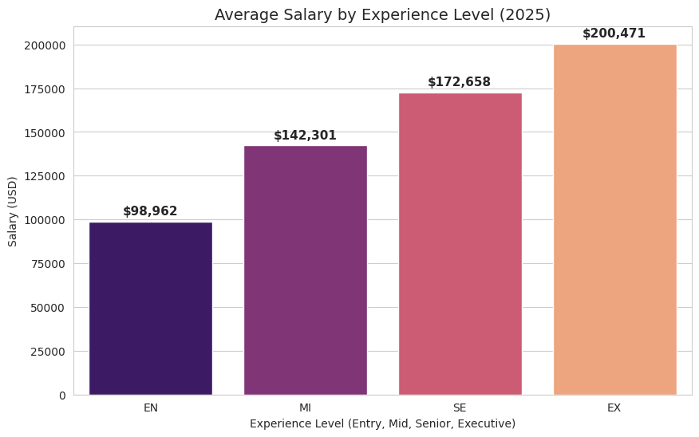
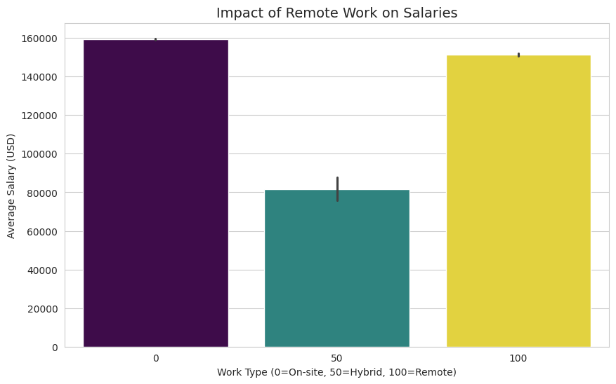
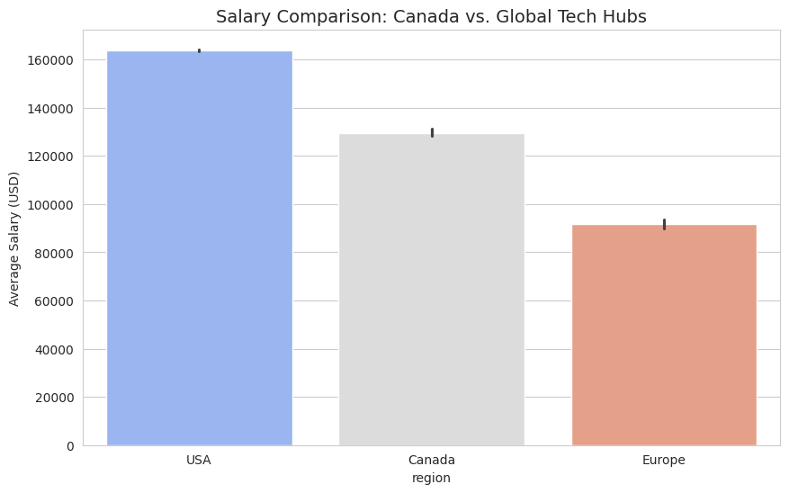
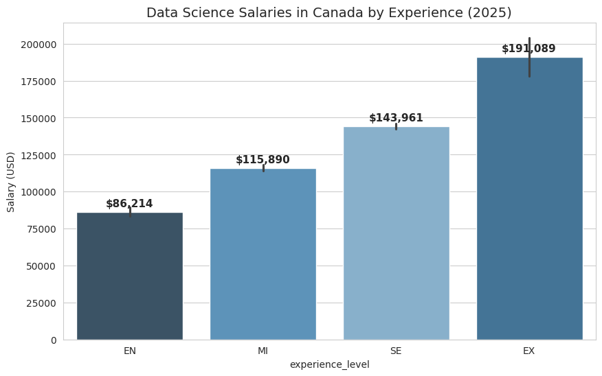
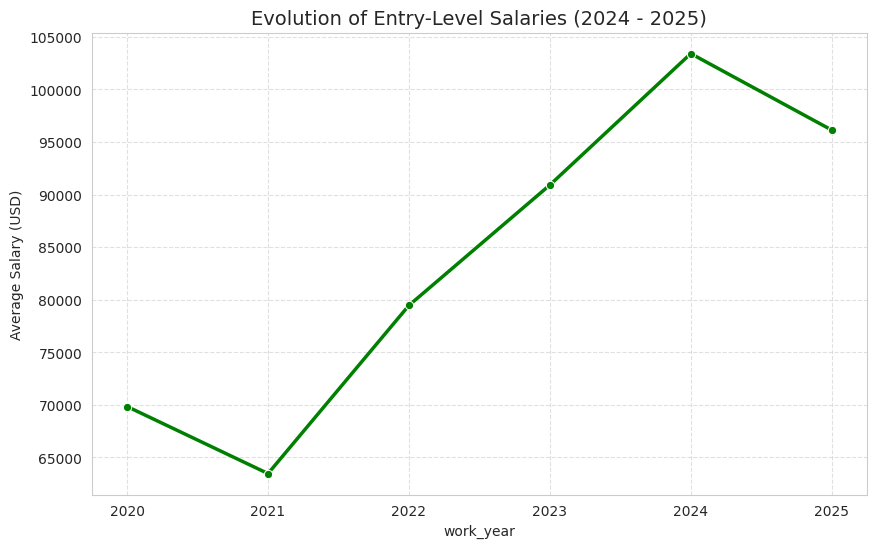

# Data Science Salary Analysis

## Objective
This project explores salary trends in Data Science roles based on experience level, job title and employment type.

The goal is to understand how different factors influence compensation in the data field and extract insights that could support career decisions and hiring strategies.

---

## Dataset
Public dataset containing information about data science salaries, roles, experience levels and employment types.

Variables include:
- Job title
- Experience level
- Salary
- Employment type
- Company location

---

## Tools & Technologies
- Python
- Pandas
- Matplotlib
- Jupyter Notebook

---

## Key Questions
This analysis aims to answer:

- Do senior professionals earn significantly more than entry-level?
- Which roles offer the highest compensation?
- How experience level impacts salary distribution?
- Are there noticeable trends across job categories?

---

## Data Cleaning
The dataset was processed using Pandas:

- Missing values handled
- Columns standardized
- Salary values prepared for analysis
- Categorical data structured for visualization

---

## Exploratory Data Analysis (EDA)

The analysis focused on:

- Salary distribution by experience level
- Salary trends by job title
- Relationship between role seniority and compensation
- Overall salary behavior in data-related positions

---

## Visualizations

### Salary by Experience Level

### Impact of Remote Work on Salaries

### Salary Comparison: Canada vs. Global Tech Hubs

### Data Science Salaries in Canada by Experience (2025)

### Evolution of Entry-Level Salaries (2024 - 2025)

---

## Key Insights

- Senior professionals earn significantly higher salaries compared to entry-level roles.
- Machine Learning and specialized roles tend to have higher compensation ranges.
- Experience level is one of the strongest predictors of salary variation.
- Salary distribution becomes more concentrated at higher ranges for experienced professionals.

---

## Conclusion

Experience plays a critical role in salary growth within the data science field.  
As professionals advance from junior to senior positions, compensation increases significantly, especially in specialized and technical roles.

This analysis reinforces the importance of skill development, specialization and experience accumulation for long-term career progression in data.

---

## Project Structure

Data-Science-Salary/
│
├── data/
├── notebooks/
├── images/
└── README.md

---

## Future Improvements

- Build an interactive dashboard
- Deploy insights using Streamlit
- Integrate SQL-based analysis
- Expand dataset for regional comparison

---

## Author

Arthur Brodbeck  
Aspiring Data Analyst focused on Python, Data Exploration and Insight Generation.

GitHub: https://github.com/BrodbeckArthur  
LinkedIn: https://www.linkedin.com/in/arthur-brodbeck-4ab89a253/
